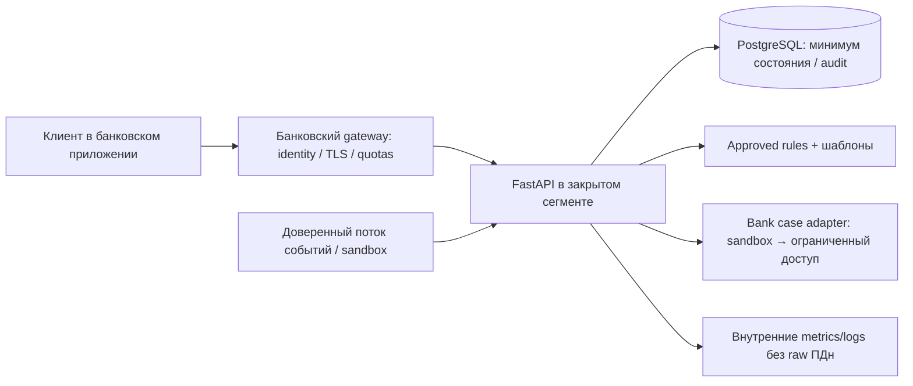

# Безопасность и регулирование

Дата 08.10.2026. Оценка фактического прототипа, не юридическое заключение и не аттестация. [Локальные доказательства](EVIDENCE_REGISTER.md), [дефекты](TECHNICAL_AUDIT.md).

## Данные и границы доверия

Фактический POST analyze: id, user_id, время, тип, сумма, counterparty, device_id, давность смены SIM, выбранный язык. POST sim: старый/новый телефон, два boolean. Ответы квиза — индексы. В репозитории синтетические данные, паспортов/карт/биометрии нет. В реальном контуре телефоны и идентификаторы, связанные с человеком, могут быть ПДн; история операций и сведения о клиенте требуют оценки режима банковской тайны. Псевдонимизация сама по себе не означает обезличивание.

Доверенные банковские факты о клиенте, SIM, устройстве и операции в пилоте должны поступать от сервера банка. Сейчас их может произвольно задать любой API-клиент. API не отделяет клиента от аналитика или администратора. В памяти процесса данные живут в запросе; собственной БД, backup и политики удаления нет. Это не доказательство полного отсутствия копий: browser memory, reverse proxy и системные журналы тоже надо учитывать.

| Граница | Сейчас | Требование до реальных данных |
|---|---|---|
| Browser → API | HTTP localhost; нет identity и TLS | Банк подтверждает сессию, subject binding, gateway TLS, RBAC; запрет прямого клиентского изменения доверенных фактов |
| API → ядро | Принятый JSON; неполная валидация | Строгие schemas, лимиты строк/тела, единое время, один субъект, дедупликация |
| Ядро → UI | Строки reasons в innerHTML | reason codes и textContent, CSP после удаления inline handlers |
| UI → CDN | Внешний исполняемый Tailwind JS | Локальные ассеты, deny egress; self-host или закрыть docs |
| API → действия банка | Отсутствует | Вначале только shadow/read-only; отдельный адаптер и подтверждённые статусы, least privilege |
| Оператор → данные/политики | Ролей нет | SSO/RBAC, аудит изменения правил, четырёхглазный review значимых policy |

CDN получает сетевой запрос браузера, включая сетевые метаданные. Прямой отправки транзакций на CDN в коде нет; внешнее исполняемое JS имеет возможности в контексте страницы. Нельзя говорить «данные уже утекли» без доказательств, но это ненужная граница риска для on-prem.

## Threat model

Активы: корректный риск, ПДн/операции, доверие к предупреждению, будущие case_id и аудит. Противники: недоверенный API-клиент, мошенник с контролем клиента, злоумышленник в сети, скомпрометированная зависимость, ошибающийся оператор. Не предполагается доступ к production банка.

| Угроза | Вектор / подтверждение | Последствие | Контроль / этап |
|---|---|---|---|
| Подмена субъекта/сигналов | client user_id/SIM/device; E12/E21 | Некорректный риск и чужие сведения при будущей интеграции | Server identity + trusted event adapter; пилот |
| Подделка OTP | otp_ok_* в JSON, T01 | При подключении к реальной смене — захват доступа | Не подключать этот endpoint к IAM; банковская проверка challenge, TTL, attempts, replay, recovery; пилот |
| Ложное ощущение защиты | contactSupport только DOM, E09 | Человек считает деньги защищёнными | Уже для демо явно «имитация»; серверный case и подтверждённый статус позже |
| Отказ в обслуживании | 500 на date, строки без length, body/read fallback | Демо падает или сервис перегружен | Контролируемые 4xx, quotas, gateway body/timeouts; MVP/пилот |
| Неправильное срабатывание | смешение клиентов, повтор событий, ноль, future | Ложные обвинения/пропуск риска | T03–T09, валидация и независимый quality gate; MVP |
| HTML-инъекция | reasons → innerHTML; E27 PARTIAL | Потенциально изменение DOM/исполнение при небезопасном источнике | textContent; CSP и dependency review; MVP. Exploit не доказан |
| Supply chain/CDN | внешний JS; unconstrained pip path | Изменение поведения, нарушение изоляции | Локальная сборка, frozen deps, SBOM, registry mirror, подпись артефактов; MVP/пилот |
| Утечка через журнал | нет политики, user_id/phone могут появиться при расширении logs | Неограниченное распространение идентификаторов | allowlist полей логов, redaction, TTL и ACL; пилот |
| Повтор действия | будущий case/reward без idempotency | Повтор обращений/наград | unique key и атомарная запись состояния; до подключения действия |
| Ошибочная блокировка | эвристический риск принимают за юридический факт | Ограничение законного клиента | Не осуществлять автономные блокировки в MVP; bank policy + human review; пилот |

CORS * не заменяет аутентификацию и сам по себе не является полным обходом авторизации. Сейчас auth вообще отсутствует; CSRF для cookie-session оценивается после выбора этой схемы. Закрытие `/docs` уменьшает экспозицию, но не защищает неавторизованный API.

## Применимость требований

Официальные источники S01/S02 описывают антифрод и информирование. Полные актуальные редакции законов и нормативных актов не сверены; точная применимость определяется назначением компонента и банком. Не выводить правовую квалификацию из score.

| Уровень | Что требуется |
|---|---|
| Уже для конкурсного MVP | Только синтетика; отсутствие ложных утверждений о блокировке/OTP/выплате; безопасная обработка JSON и текстов; локальные assets; описание обработки данных и рисков; согласование публичного юридического текста |
| Для пилота с ПДн | Уточнить роли оператора/обработчика по 152-ФЗ, цели/основания/минимизацию, локализацию при применимости, сроки, доступы, удаление/архив, incident response; договорные и технические меры |
| AML / 115-ФЗ | При использовании результата банком для AML — согласовать правила и процесс с комплаенс. Демонстратор не выполняет банковские обязанности AML и не подтверждает основания блокировки |
| Переводы / 161-ФЗ | При подключении к потоку переводов — согласовать антифрод, режим информирования и решения об операциях с банком; информирование, AML и payment antifraud не смешивать |
| Информационная безопасность банка | Банк определяет применимые акты Банка России, стандарты и криптографические требования, модель угроз, класс системы, logging и доступы. Упоминание 683-П в S02 не доказывает актуальность/достаточность полного перечня для этого пилота |
| Банковская тайна | Юристы банка определяют состав, основания передачи и режим доступа к операциям и данным клиента |
| Не относится сейчас | PCI-сертификация карточного процессинга, лицензирование платёжного оператора, требования к собственному inference/биометрии: соответствующих функций нет. При изменении scope пересмотреть |

Нельзя утверждать, что передача карты всегда автоматически является соучастием, или что любая RED-ситуация обязательно приводит к конкретному сроку лишения свободы. `src/alerts.py` и `src/quiz.py` требуют юридического и языкового review. Безопасный текст: «Операции похожи на рискованную схему. Не пересылайте деньги по просьбе незнакомцев. Свяжитесь с банком через официальный канал». Конкретные основания и последствия сообщает банк по обстоятельствам.

## Рекомендуемый on-prem

Все frontend/docs-ресурсы локальны; runtime egress запрещён по allowlist. Образы и зависимости поставляются через разрешённый registry; отсутствие сети проверяется отдельно. Secrets — в банковском secret store/защищённой конфигурации, не Git; сервисная identity с минимальными правами. Шифрование внутри/на диске и выбранные средства определяет ИБ банка; произвольное «AES/TLS» не является доказательством соблюдения российских требований. DB backup с ACL, сроками и тестом восстановления; audit append-only по согласованному процессу. Тест восстановления и offline deploy сейчас **НЕ ПОДТВЕРЖДЕНЫ**.

## Входной security gate пилота

Владелец данных и процесса назначен; data flow согласован; security schemes и RBAC протестированы; нет открытых критических дефектов; SBOM/лицензии проверены; уязвимости обработаны; логи не содержат raw телефонов/операций; egress-test и restore-test пройдены; ошибки и таймауты возвращают безопасный статус; регуляторные/правовые тексты одобрены. Это будущие критерии, не уже выполненная проверка. Отсутствие реальных данных позволяет локальное демо сейчас, но не снимает эти условия для пилота.
