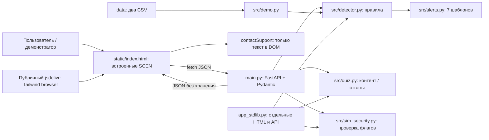

# Технический аудит

08.10.2026. Основания и статусы: [реестр](EVIDENCE_REGISTER.md), [машинные результаты](verification-results.json), [OSV](dependency-audit.json).

## Действительная архитектура

Нет БД, очередей, аутентификации, миграций, банковских/телеком-интеграций, модели ИИ, CI/CD и Docker. Это не скрытые недоработки инфраструктуры: приложение действительно является stateless-демонстратором. Векторного поиска, RAG и inference нет. «Мониторинг» запускается загрузкой фиксированного сценария или ручным POST, не подпиской на банковские события.

Главный поток: выбор сценария → SCEN преобразуется в транзакции → POST analyze → сортировка, окна 60 минут/24 часа, суммирование правил → RED/YELLOW/GREEN → при RED языковой шаблон → DOM. Данные не сохраняются. Кнопка поддержки заканчивает поток локальным сообщением, а не банковским действием.

## Инвентаризация

| Область | Реально есть | Ограничение |
|---|---|---|
| Backend | FastAPI, 7 API-маршрутов: 3 GET, 3 POST и health; static, docs | Всего GET API: health/langs/content = 3; POST: analyze/quiz/sim = 3. Не считать автоматически созданные docs банковской интеграцией. |
| Схемы | Pydantic v2, Literal типов, amount ≥0, ≤5000 операций | ts — строка; user_id/id часто по умолчанию; нет запрета смешанных субъектов |
| Логика | Семь правил, ограниченный score 0–100 | Нет калибровки, вероятностной интерпретации и проверки на отложенной выборке |
| Frontend | Один HTML, Tailwind CDN, vanilla JS | Нет сборки, типизации, обработки fetch-ошибок и устойчивого состояния |
| Данные | Два CSV + SCEN в JS + константы контента | Нет персистентности и событий аналитики |
| Резервный сервер | HTTPServer, встроенные HTML/CSS | Второй UI/API, другой контракт, меньше валидации, раскрывает правильные ответы |
| Качество | unittest, httpx TestClient, uv.lock | Нет конфигурации lint/typecheck, UI regression и CI; штатные тесты узкие |
| Локальный deploy | start-local.ps1, .venv, журналы .local | Скрипт из предыдущего задания; не банковский deployment и не авторестарт |

## Результаты запуска

14/14 tests PASS; pip check PASS; синтаксис 12 Python-файлов PASS. Живой API и Edge подтверждают норму GREEN/0, атаку RED/85. Семь алертов возвращаются по выбранному коду. Переводы не проверены носителями. Резервный сервер проверялся временно на случайном localhost-порту, закрыт после проверки.

Установлено: FastAPI 0.142.4, Pydantic 2.13.5, Uvicorn 0.54.0, Starlette 1.7.0, httpx 0.28.1. Это фактически установленный набор, не заявление о latest. OSV querybatch вернул 0 известных advisory для 22 установленных пакетов, исключая pip. uv.lock содержит более широкий набор из fastapi[standard]; не все его ветки проверены. Сборка frontend отсутствует по архитектуре; отдельные lint/typecheck не настроены и не заявляются пройденными. Чистая установка из lock на другом ПК не выполнялась.

## Реестр дефектов и разрывов готовности

Трудозатраты — инженерные оценки в человеко-днях, включая узкие регрессионные проверки, без банковских согласований. **BLOCKER/CRITICAL для пилота не означает невозможность показать синтетическое локальное демо.**

| ID / тяжесть / статус | Файл, причина и последствие | Воспроизведение | Исправление / трудоёмкость / конкурс |
|---|---|---|---|
| T01 BLOCKER пилота, PARTIAL | `models.py:61–65`, `src/sim_security.py:26–49`: клиент сам утверждает OTP; номер и лимиты не сохраняются | POST sim с обоими true → ok=true без SMS | Исключить из основного MVP; если сохранять для пилота — банковский IAM/OTP, серверный state machine, TTL, replay protection и enforcement. 5–10+ дней после контрактов. Подрывает доверие к защите |
| T02 HIGH, VERIFIED | `static/index.html:151–154`: ложное подтверждение поддержки/заморозки | Нажать поддержку; только DOM меняется | Явная демо-пометка; затем sandbox case API с устойчивым case_id и статусом. 0.5 дня маркировка / 2–4 дня mock. Главный разрыв end-to-end |
| T03 HIGH, BROKEN | `models.py:13`, `src/detector.py:23–33`: ts строка и необработанные exceptions | ts='bad' → 500; mixed timezone → 500 | datetime schema, timezone policy, нормализация UTC и контролируемые 422; 1 день. Риск падения на вопросе жюри |
| T04 HIGH, BROKEN | `src/detector.py:110`: 0 or 999 | SIM=0, две входящие → false | Различать None/0, ge=0, параметризованный тест 0/1/2/3/None; 0.25 дня. Ошибка ключевого правила |
| T05 HIGH, BROKEN | `src/detector.py:30–50`: user_id не участвует в области анализа | Пять входящих на пять клиентов + вывод у шестого → RED/70 | Контракт одного subject_id с запретом смешения; банковский subject брать из доверенного контекста. 1 день. Иначе риск бессмысленных тревог |
| T06 HIGH пилота, VERIFIED | `src/detector.py:32–50`: нет дедупликации id | Одинаковые id с повторными событиями принимаются | В API одного snapshot отклонять дубликаты; в event adapter уникальный source+event_id. 1–2 дня. Защита от искусственного роста риска |
| T07 MEDIUM, BROKEN | `models.py:15`, `src/detector.py:46–53`: ноль допустим и участвует в числе мелких входящих | Пять входящих amount=0 → YELLOW/45 | Исключить непроведённые/нулевые операции по контракту, amount>0 для переводов. 0.5 дня |
| T08 MEDIUM, BROKEN | `src/detector.py:33,43,81`: now последняя операция; нет верхней границы | Будущая операция относительно явного now учитывается | Явный analysis_at, [start,now], режим исторического replay отдельно. 1 день |
| T09 HIGH пилота, PARTIAL | `src/detector.py:52–128`: произвольные пороги, сумма коррелированных правил | Калибровочных данных нет | Набор легитимных/рисковых эпизодов, временной holdout, отчёт FPR/recall. 3–5 дней + получение данных. Не называть 85 вероятностью 85% |
| T10 HIGH, BROKEN | `app_stdlib.py:159–162`: QUIZ целиком в HTML | GET / содержит correct | Убрать fallback из конкурсного пути или выдавать sanitized quiz; 0.5 дня. FastAPI ответ не раскрывает correct |
| T11 MEDIUM, BROKEN | `app_stdlib.py:167`: кириллица в status reason не кодируется latin-1 | GET /docs или /missing → разрыв соединения | ASCII reason, UTF-8 body; 0.25 дня. Не обещать одинаковый контракт двух серверов |
| T12 HIGH вне localhost, VERIFIED | `app_stdlib.py:170–175,212`: неограниченный body/read, нет timeout policy, bind 0.0.0.0, однопоточный сервер | Статическое чтение; DoS не запускался | Не выставлять fallback в сеть; убрать из deployment. 0.5 дня |
| T13 MEDIUM, BROKEN | `src/sim_security.py:13–25`: нормализация только для regex, сравнение raw strings | Один телефон с пробелами/дефисами принят новым | Каноническая форма перед сравнением/сохранением; 0.5 дня |
| T14 HIGH пилота, VERIFIED | `main.py:35–40,71–100`: нет auth, ACL, rate limit; CORS * | Без Authorization все demo API работают; preflight * | Для демо только синтетика; для пилота gateway identity, RBAC/subject binding, TLS/mTLS, quotas. 3–5 дней + банк |
| T15 MEDIUM, PARTIAL | `src/detector.py:125`, `static/index.html:130–143`: непроверенный текст в innerHTML | Подтверждён sink, исполнение JS не воспроизведено | textContent/DOM construction; reason codes + безопасные параметры. 0.5–1 день. Не преувеличивать как доказанный exploit |
| T16 MEDIUM, VERIFIED | `static/index.html:137–179`: нет res.ok/catch/loading; ответы могут прийти в другом порядке | Инспекция; сетевые гонки не воспроизводились | Ошибки/повтор, disable button, request sequence/AbortController. 1 день |
| T17 MEDIUM, VERIFIED | `static/index.html:7`: зависимость от внешнего исполняемого JS | URL CDN в HTML | Скомпилировать CSS локально; self-host Swagger либо закрыть docs. 0.5–1 день. Надёжное офлайн-демо |
| T18 MEDIUM, VERIFIED | `src/quiz.py:75–96`: нет пользователя и учёта награды | Два запроса → два сообщения 100 | Пометить награду условной, убрать реальное обещание; ledger/idempotency только при реальном reward adapter. 0.25 дня маркировка |
| T19 MEDIUM, VERIFIED | `models.py:15`, `src/detector.py:46–86`: float для денег | Нет денежных проводок; арифметика классификатора | Для интеграции integer minor units или Decimal с валютой и округлением. 0.5–1 день; сейчас не дефект списания денег |
| T20 MEDIUM, VERIFIED | `requirements.txt:1–4`, `pyproject.toml:9–14`: нижние границы, разные extras | pip-среда не равна всей uv.lock | Один frozen-путь установки, разделить dev/runtime, smoke в CI. 1 день |
| T21 MEDIUM, VERIFIED | `src/alerts.py:23–29`, `src/quiz.py:13–69`, `src/detector.py:56–107`: категоричные обвинения/юридические исходы | Текст шаблонов | Нейтральный язык риска, согласованный юридический текст и перевод носителями. 1–2 дня + review |
| T22 LOW/MEDIUM, VERIFIED | `static/index.html:94–101`: input телефонов без label, aria-live для результатов нет, арабский без dir | По коду; assistive tests не проводились | label/inputmode/tel, live region, keyboard focus, RTL, reduced motion. 1–2 дня |

Нет дефекта «двойное списание»: проект вообще не списывает деньги. Нет конкурентных обновлений или транзакций БД, поскольку нет состояния. Именно поэтому promise «заморожено» нельзя считать выполненной финансовой операцией. При введении ticket/reward нужна идемпотентность; при платежном enforcement — отдельный доверенный банковский контур.

## Качество и эксплуатация

Дублируется прежде всего UI и API-обвязка `app_stdlib.py`, а не само ядро. Сохранить один путь FastAPI. Сложность ядра примерно O(n log n) сортировка + несколько O(n) проходов; повторный парсинг ts можно убрать после корректной валидации. Переписывать на Go ради 5000 операций не обосновано.

Объяснения «нетипично для вас» не опираются на персональную baseline. Алгоритм не проверяет порядок прихода/вывода денег, только суммы окна; вывод мог предшествовать поступлениям. Device novelty использует первые две операции как fallback-историю, не реестр доверенных устройств. Поля counterparty/device_id допускают пустые строки и неограниченную длину; данные о SIM и устройстве не должны приходить из недоверенного браузера в пилоте.

FastAPI sync handlers допустимы для короткого CPU-анализа; переход на async сам по себе CPU не ускорит. Нужны ограниченный размер HTTP-body на gateway, лимиты concurrency и deadline. Метрики requests/latency/errors, version rules и request_id отсутствуют. Uvicorn access-log не является аудитом банковского действия. В fallback log_message отключён, что дополнительно затрудняет диагностику.

Конфигурация сейчас в константах; для пилота отделить policy version/thresholds от runtime secrets, с контролем изменений. Проверенных секретов в отслеживаемых исходниках не выявлено при чтении; история Git и полноценный secret scanner не проверялись. `.local` не игнорируется, не коммитить рабочие журналы автоматически.

## Минимальная стратегия проверки после исправлений

Контракт: invalid time, timezone normalization, mixed subject, duplicates, future, empty, 5000/5001, zero/negative/nonfinite amounts. Правила: границы 2/3/5 входящих, 0/1/2/3 дня SIM, 59/60/61 минут, порядок out-before-in. Alert: RED без small incoming должен давать подходящее объяснение, а не ложный текст о транзите. UI: ошибочный API, повторный click, смена сценария при задержке, RTL и offline assets. Ticket mock: повтор одного idempotency key даёт один case_id; timeout не превращается в «создано».

Нынешние тесты не измеряют эти свойства. `test_cashout_is_red` допускает и YELLOW: название сильнее проверки; `test_quiz_cashback` для плохих ответов проверяет конъюнкцию, а не независимо passed=false и cashback=0. Добавлять точные тесты по найденным рискам, без механического зеркалирования реализации.
